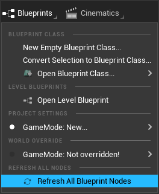
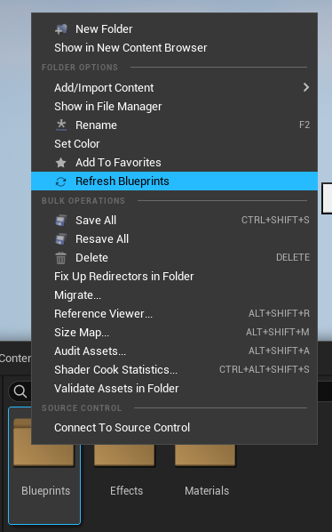
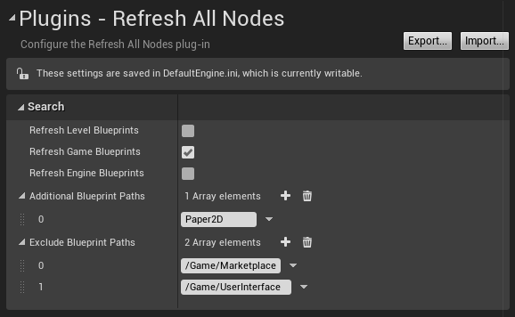

# Refresh All Nodes

*Unreal Engine plugin that refreshes all blueprint nodes in every blueprint* 

**The latest RefreshAllNodes version only supports UE versions 5.1 and later.**

For use with UE 5.0 and earlier, use the [RefreshAllNodes v1.4 release](https://github.com/nachomonkey/RefreshAllNodes/releases/tag/v1.4%2B1-UE5.0.3)

## Installation

### Pre-compiled

*The pre-compiled releases of this plugin are compiled running Windows 10 (64-bit).*

* Download a release that matches your version of Unreal Engine [from here](https://github.com/nachomonkey/RefreshAllNodes/releases), and extract it into your project's Plugins directory.

* Relaunch the editor.

### Compiling from source

* Clone or download the repository into your project's `Plugins` directory and relaunch the editor.

* A message should appear asking to compile the plugin.

## Usage

This plugin adds the **`Refresh All Blueprint Nodes`** button to the Blueprints toolbar menu:

As stated, the button will search for your Blueprints, open, them, and excecute the built-in "Refresh all nodes" function. By default, all blueprints are then compiled.

The **`Refresh Blueprints`** action can be found in the Content Browser's context menu to refresh blueprints in certain folders:

* *Note: Refreshing blueprint nodes may cause node breakages or change variable types, especially in certain circumstances following a `HotReload`.*
* *Note: I have not used RefreshAllNodes with Source Control, so it may cause undesired behavior by resaving every blueprint.*

### Configuration

The plugin can be configured under **`Project Settings` ->  `Plugins` -> `Refresh All Nodes`**

* Compile Blueprints: If checked, the plugin will compiled the blueprints after refreshing them. Enabling compilation will allow the plugin to catch  errors in the blueprints, but it will take more time to process.

* Refresh Level Blueprints: If checked, the plugin will search for level blueprints. This will cause the corresponding levels to be opened and saved, which can consume extra memory.
* Refresh Game Blueprints: If checked, the plugin will refresh blueprints found in the project's Content folder.
* Refresh Engine Blueprints: If checked, the plugin will refresh blueprints found in the engine's Content folder.
* Additional Blueprint Paths: Array of additional paths to search in. Most useful for plugins. Add the name of the plugin to refresh its blueprints.
* Exclude Blueprint Paths: Array of paths to not refresh blueprints in. Useful for excluding blueprints that are expensive to load.

## Limitations

This plugin's ability to refresh nodes is limited to Unreal Engine's built-in "Refresh All Nodes" function. The purpose of this plugin is only to provide an easy way to perform such action on Blueprint assets. This plugin is not responsible for any damage to Blueprints or any data loss.

# License

RefreshAllNodes is free software, licensed under the MIT License as contained in the [LICENSE](LICENSE) file.
